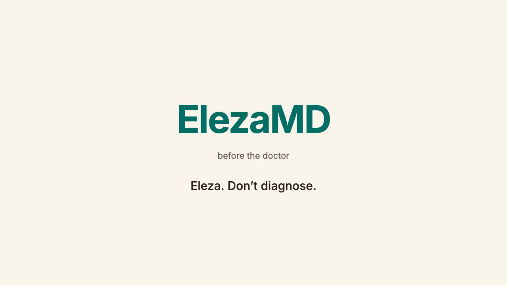
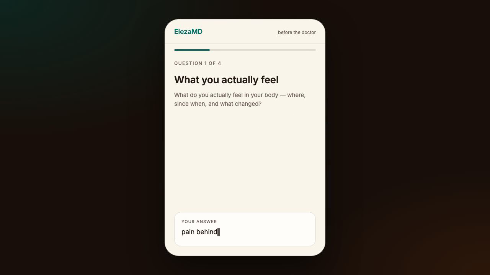
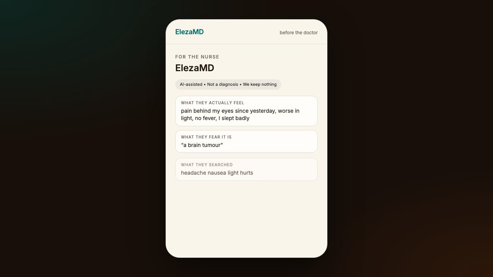
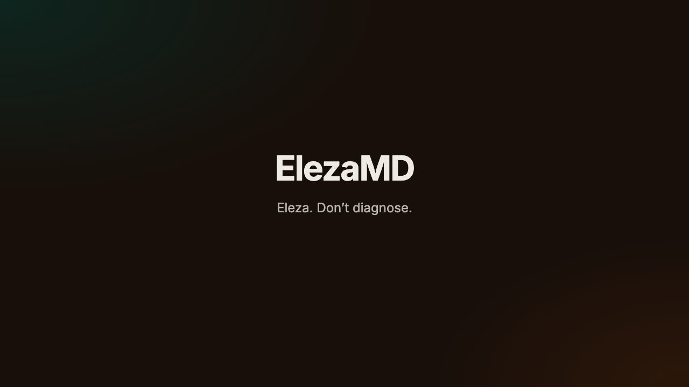

# ElezaMD

Waiting-room note. The patient explains; the clinician decides. No patient file.

## Presentation

**[Watch the 51-second presentation →](https://claude.ai/code/artifact/64db05ce-727f-4fd8-9e5f-316400f05532)** · [.mp4 on GitHub](docs/elezamd-presentation.mp4)

| | | | |
|---|---|---|---|
|  |  |  |  |
| Brand | The four questions | The note | Close |

Built with [Remotion](https://www.remotion.dev); source in the sibling `elezamd-video` project.

```bash
npm run dev
```

Open [http://localhost:3000](http://localhost:3000). Phone-width viewport is the intended demo.

```bash
npm test
npm run lint
npm run build
```
